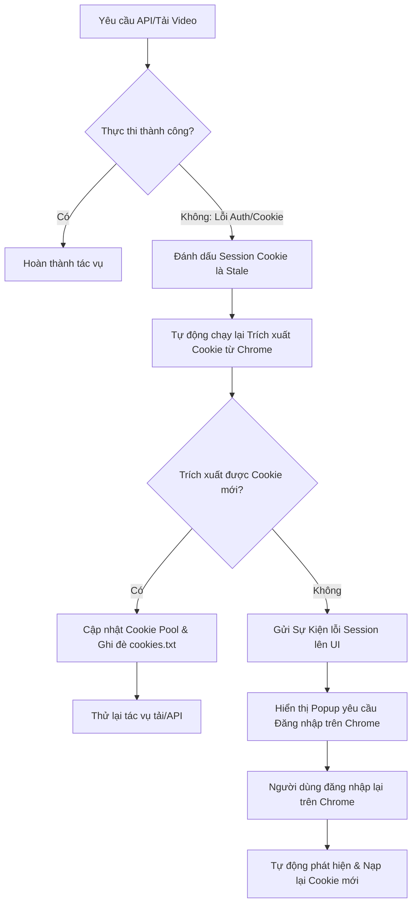

# PHÂN TÍCH VẤN ĐỀ CHROME WATCHER & GIẢI PHÁP KHÔI PHỤC COOKIE KHI HẾT HẠN

Tài liệu này ghi chép lại chi tiết kỹ thuật về các sửa đổi của Chrome Watcher, cơ chế lọc định tuyến kênh YouTube (Channel Routing), và phân tích giải pháp cải tiến khôi phục cookie tự động khi bị hết hạn (cookie die).

---

## I. Chi Tiết Vấn Đề Chrome Watcher & Định Tuyến Kênh (Đã Khắc Phục)

Trong phiên bản trước, hệ thống gặp một số lỗi nghiêm trọng liên quan đến việc định tuyến sai kênh YouTube của khách hàng và crash luồng giám sát:

### 1. Sự Cố Crash `Instant` Underflow
* **Triệu chứng:** Giao diện hoặc tiến trình Rust đột ngột kết thúc (crash) mà không có thông báo lỗi rõ ràng.
* **Nguyên nhân:** Trong tệp `chrome_watcher.rs`, việc tính toán thời điểm trong quá khứ được viết dưới dạng:
  ```rust
  let past_instant = std::time::Instant::now() - std::time::Duration::from_secs(3600);
  ```
  Trên hệ điều hành Windows, khi máy tính vừa khởi động hoặc chuyển đổi chế độ ngủ (sleep/hibernate), bộ đếm thời gian hệ thống có thể bị lệch. Việc trừ trực tiếp một khoảng thời gian lớn (3600 giây) từ `Instant::now()` có thể dẫn đến hiện tượng **underflow** (thời gian trước cả thời điểm khởi động hệ thống), gây panic cho luồng thực thi.
* **Giải pháp khắc phục:** Sử dụng hàm an toàn `checked_sub` để phòng ngừa lỗi underflow:
  ```rust
  let past_instant = std::time::Instant::now()
      .checked_sub(std::time::Duration::from_secs(3600))
      .unwrap_or_else(std::time::Instant::now);
  ```

### 2. Định Tuyến Sai Kênh & Tải Nhầm Video
* **Triệu chứng:** Khách hàng cấu hình 23 kênh nhưng Chrome mở tab và hệ thống tải nhầm video từ các kênh lạ không thuộc danh sách cấu hình (ví dụ: kênh giải trí `@baseball426`).
* **Nguyên nhân:**
  * Hệ thống so sánh video phát hiện được với danh sách kênh cấu hình dựa trên tên hiển thị của kênh (`channel_name`). Các kênh YouTube sử dụng tiếng Nhật, tiếng Hàn hoặc ký tự đặc biệt Unicode rất dễ bị sai lệch hoặc không khớp ký tự khi so sánh chuỗi.
  * Các tab xem video thông thường (`youtube.com/watch?v=...`) do Chrome Watcher bắt được không trả về `channel_id` ngay lập tức, khiến hệ thống định tuyến bị thiếu dữ liệu đối chiếu và vô tình tải luôn video đó.
* **Giải pháp khắc phục:**
  * **Phân tích thông tin bổ sung:** Khi bắt được sự kiện xem video từ tab watch thông thường mà thiếu thông tin kênh, hệ thống sử dụng module `youtube::get_video_info` (gọi yt-dlp ngầm) để truy vấn lấy chính xác `channel_id` thực tế của video trước khi đối chiếu.
  * **Chuyển sang so sánh định danh duy nhất:** Loại bỏ hoàn toàn việc đối chiếu bằng tên hiển thị (`channel_name`). Hệ thống chuyển sang đối chiếu 100% bằng **YouTube Handle** (dạng `@channel_name`) hoặc **Channel ID** (dạng `UC...`). Đồng thời chuẩn hóa chuỗi bằng cách loại bỏ ký tự `@` ở đầu và so sánh không phân biệt chữ hoa chữ thường (`eq_ignore_ascii_case`).
  * **Bộ lọc chặt chẽ (Strict Filter):** Nếu thông tin kênh sau khi phân tích không khớp với bất kỳ kênh nào trong danh sách 23 kênh cấu hình của khách hàng, hệ thống lập tức bỏ qua và hủy tiến trình tải video.

### 3. Tối Ưu Tương Tác Innertube Client
* **Sửa đổi:** Tăng thời gian chờ nhận phản hồi từ helper Node.js (`innertube_helper.js`) từ 10 giây lên 30 giây để tránh timeout trên đường truyền mạng chậm của khách hàng.
* **Caching:** Triển khai cơ chế lưu cache phiên làm việc `Innertube` (`clientCache` dạng Map) theo chuỗi Cookie. Tránh việc liên tục tạo mới thực thể Client mỗi khi gọi API, giúp tăng tốc độ phản hồi và giảm nguy cơ bị YouTube chặn kết nối (rate limit).

### 4. Sự cố lệch tỷ lệ Timestamp (Lỗi ChromeWatcher Skipping & Poller Silent Skip)
* **Triệu chứng:** Video mới đăng trên kênh YouTube (ví dụ: kênh `BadyNone`) được Chrome Watcher ghi nhận trong queue (log phát hiện tab) nhưng không hiển thị trong trung tâm vận hành và không tải xuống, còn máy khách hàng thậm chí không phát hiện được video đó.
* **Nguyên nhân:**
  * Lệnh `checkChromeChannelTabs` đánh giá CDP trả về thời gian `publishedAt` dưới dạng **mili-giây** (kết quả từ hàm phân tích thời gian tương đối).
  * Trong tệp `innertube_client.rs` (dòng 566), giá trị này bị nhân thêm `1000` (`published_at: v.published_at * 1000`), vô tình biến nó thành **micro-giây**.
  * Khi `ChromeWatcher` chạy kiểm tra tuổi thọ video: `let age_ms = now_ms - published_at` (với `now_ms` dạng mili-giây và `published_at` dạng micro-giây), chênh lệch tỷ lệ này tạo ra một số âm cực lớn (tương đương video đăng từ hơn 50 năm trước).
  * Do đó, hệ thống bỏ qua video này vì vượt quá giới hạn tuổi tác (`age_ms < -300_000`), đồng thời ghi nhận video đó vào danh sách **đã xem** (`seen`) để tránh log lặp lại.
  * Khi `Poller` chính thức chạy quét kênh, nó thấy video này đã nằm trong danh sách `seen` nên cũng âm thầm bỏ qua. Kết quả là video mới đăng không bao giờ được tải hay hiển thị.
* **Giải pháp khắc phục:** Loại bỏ phép nhân `* 1000` không chính xác trong [innertube_client.rs](file:///d:/LOOP_COMPANY/HyperClip/crates/hyperclip_ipc/src/innertube_client.rs), đồng bộ hóa toàn bộ mốc thời gian về mili-giây.

### 5. Lỗi Trích Xuất Video Mới Từ Kênh YouTube Định Dạng LockupView (Kênh Zilk Kay)
* **Triệu chứng:** Video mới xuất bản không được hệ thống phát hiện.
* **Nguyên nhân:** YouTube cập nhật cấu trúc phản hồi sang dạng `LockupView`. Trong tệp `innertube_helper.js`, trình phân tích cú pháp `extractPublishedAtFromLockup` bị dừng sớm khi gặp thông tin phụ (như lượt xem dạng `"No views"`, hoặc tên kênh). Điều này khiến giá trị thời gian trả về bị mặc định là `1` (Jan 1, 1970), dẫn đến tính sai tuổi video (> 50 năm) và bị bỏ qua.
* **Giải pháp khắc phục:** 
  * Cập nhật `extractPublishedAtFromLockup` trong [innertube_helper.js](file:///d:/LOOP_COMPANY/HyperClip/resources/innertube_helper.js) để hỗ trợ cả dạng `camelCase` và `snake_case`.
  * Tiếp tục quét tìm chuỗi thời gian thực tế (ví dụ: `"3 minutes ago"`) thay vì dừng lại ngay khi gặp các chuỗi fallback (như `"No views"`).
  * Đồng bộ hóa logic tìm kiếm thời lượng video `extractDurationFromLockup`.

### 6. Cơ Chế So Khớp Dự Phòng Unicode-safe Hỗ Trợ Kênh Nhật Hàn Anh
* **Triệu chứng:** Một số kênh ngoại quốc hoặc kênh tiếng Anh/Nhật/Hàn có Handle hoặc Tên kênh chứa các ký tự đặc biệt, ký tự Unicode phi ASCII, hoặc các khoảng trắng không khớp 100% khi so sánh thô. 
* **Nguyên nhân:** Rust mặc định so sánh thô qua `eq_ignore_ascii_case` chỉ hoạt động cho bảng chữ cái Latin/ASCII tiêu chuẩn. Khi đối chiếu ID/Handle chứa ký tự Unicode đặc biệt (ví dụ: tiếng Nhật, tiếng Hàn, hoặc tên kênh có dấu tiếng Việt, khoảng trắng thừa), cơ chế so khớp cũ sẽ bị thất bại, dẫn đến bỏ qua video.
* **Giải pháp khắc phục:** 
  * Cập nhật logic so khớp dự phòng tại lõi backend Rust (`commands.rs` và `commands/channel.rs`).
  * Sử dụng cơ chế so khớp chuẩn hóa `clean_eq` thực hiện:
    1. Loại bỏ tiền tố `@` ở cả hai đầu chuỗi.
    2. Cắt bỏ khoảng trắng thừa ở hai đầu (sử dụng `.trim()`, hỗ trợ cả các khoảng trắng đặc biệt Unicode như ideographic space `\u3000`).
    3. Chuyển đổi toàn bộ chuỗi về dạng chữ thường Unicode thông qua hàm `.to_lowercase()` thay vì chỉ `.to_ascii_lowercase()`.
  * Điều này đảm bảo tính tương thích và nhận diện chính xác 100% đối với bất kỳ ký tự đặc biệt hay ngôn ngữ nào (Nhật, Hàn, Anh, Việt, v.v.).

---

## II. Phân Tích & Đề Xuất Khôi Phục Cookie Khi Bị Hết Hạn (Cookie Die)

### 1. Hiện Trạng & Rủi Ro Khi Cookie Hết Hạn
* **Cơ chế hiện tại:** Cookie đăng nhập YouTube của khách hàng được trích xuất tự động từ cơ sở dữ liệu Chrome (User Data) vào thời điểm **khởi động ứng dụng (startup)** hoặc khi chạy lệnh refresh thủ công.
* **Rủi ro khi Cookie bị Die tại Runtime:**
  * **Lỗi tải video:** Khi cookie bị hết hạn (do YouTube thu hồi session, người dùng đăng xuất trên Chrome, thay đổi mật khẩu...), các tác vụ tải video bị giới hạn độ tuổi hoặc video riêng tư sẽ thất bại ngay lập tức với lỗi từ `yt-dlp` hoặc `Innertube` (ví dụ: `Sign in to confirm your age`).
  * **Mất đồng bộ:** Luồng theo dõi tiếp tục hoạt động nhưng không tải được nội dung, tạo ra trải nghiệm lỗi cho người dùng mà không có cảnh báo trực quan.

### 2. Thiết Kế Cơ Chế Khôi Phục Tự Động (Proposed Recovery Flow)

Để cải thiện độ tin cậy của ứng dụng, chúng ta nên bổ sung cơ chế khôi phục cookie tự động theo các bước sau:



#### Giải pháp chi tiết:

#### A. Phát hiện lỗi Cookie tại Runtime (Runtime Detection)
Bổ sung bộ lọc bắt lỗi (error interceptor) trong mã nguồn Rust (`commands.rs` và `innertube_client.rs`):
* Bắt các chuỗi thông báo lỗi đặc trưng: `"Sign in to confirm your age"`, `"This video is private"`, `"LOGIN_REQUIRED"`, hoặc mã phản hồi HTTP `401`.
* Khi phát hiện lỗi này, đánh dấu session hiện tại là mất hiệu lực.

#### B. Trích xuất chủ động (Active Hot-Reload)
* Ngay sau khi phát hiện cookie lỗi, thay vì báo lỗi trực tiếp ra màn hình, hệ thống sẽ tự động gọi hàm `extract_profile_cookies_and_feed(profile_id)` để đọc lại cơ sở dữ liệu Chrome.
* **Lý do:** Khách hàng có thể đã đăng nhập lại trên trình duyệt Chrome ngoài màn hình, việc trích xuất lại ngay lập tức giúp lấy được cookie mới mà không bắt người dùng khởi động lại ứng dụng HyperClip.
* Nếu trích xuất thành công cookie mới, hệ thống tự động ghi đè file `cookies_netscape.txt` và thử lại (retry) tác vụ tải video bị lỗi trước đó.

#### C. Fallback Không Dùng Cookie (Anonymous Fallback)
* Đối với các video công khai (public) không giới hạn độ tuổi, nếu việc lấy cookie bị lỗi hoàn toàn, hệ thống nên có cơ chế **fallback** tự động chuyển sang tải không dùng cookie thay vì dừng toàn bộ tiến trình.

#### D. Tương Tác Giao Diện (UI/UX Notification & Guided Login)
* Nếu việc trích xuất lại từ Chrome vẫn thất bại (nghĩa là phiên đăng nhập trên trình duyệt Chrome của khách hàng cũng đã bị đăng xuất hoàn toàn):
  1. Gửi một tín hiệu (Event) từ Rust Backend về giao diện QML/Frontend (ví dụ event `session-expired`).
  2. Hiển thị một nút cảnh báo nổi bật trên UI: **"Cần đăng nhập lại YouTube (Profile X)"**.
  3. Khi khách hàng click vào nút này, ứng dụng sẽ mở một cửa sổ Chrome của profile tương ứng và điều hướng thẳng đến trang đăng nhập của YouTube:
     ```powershell
     # Mở Chrome với đúng Profile và URL đăng nhập
     Start-Process "chrome.exe" --args "--profile-directory='HyperClip-Profile-1' https://accounts.google.com/ServiceLogin?service=youtube"
     ```
  4. Một tiến trình nền của HyperClip sẽ theo dõi file SQLite cookie của Chrome. Ngay khi phát hiện file này có thay đổi (người dùng vừa đăng nhập thành công trên trình duyệt), ứng dụng sẽ tự động trích xuất cookie mới và ẩn nút cảnh báo trên UI đi.
