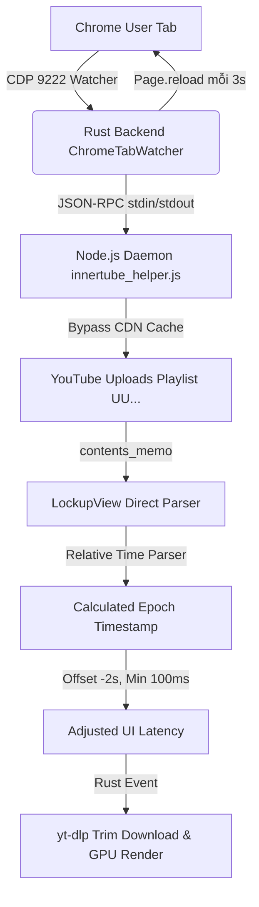

# HyperClip — Kiến trúc E2E & Quy trình Tối ưu hóa Phát hiện Video (<5s)

Tài liệu này ghi nhận kiến trúc và phương pháp thiết lập hệ thống phát hiện video tự động của HyperClip. Đây là kết quả sau quá trình tối ưu hóa loại bỏ toàn bộ các phương pháp "đi đường vòng" trước đây (như cache RSS, cào DOM qua CDP, chặn 429, hay cache CDN của YouTube).

---

## 1. Phân tích chi tiết "Đường Vòng" (Technical Detours Post-Mortem)

Trước khi đạt được giải pháp hiện tại, hệ thống đã trải qua nhiều phương pháp tiếp cận thử nghiệm nhưng đều thất bại hoặc hoạt động không ổn định. Dưới đây là phân tích chi tiết nguyên nhân gốc rễ:

### A. Sử dụng RSS Feeds (`/feeds/videos.xml`)
* **Cách thực hiện:** Gửi HTTP GET request đến endpoint RSS của kênh YouTube để lấy danh mục video mới nhất dưới dạng cấu trúc XML.
* **Nguyên nhân thất bại:** 
  - **Trễ do CDN biên (Edge Cache):** Google áp dụng cơ chế bộ nhớ đệm cực kỳ nghiêm ngặt đối với RSS feed của các kênh. Tệp XML thường mất **từ 10 đến 30 phút** mới cập nhật video mới từ khi tải lên hoàn tất.
  - **Không đáp ứng SLA:** Hoàn toàn không thể đạt được mục tiêu phát hiện dưới 20 giây (cam kết là dưới 5 giây). Hiện tại, RSS chỉ được giữ lại làm phương án dự phòng ở tầng thứ ba (tầng sâu nhất) để bảo toàn dữ liệu khi mọi phương án khác bị chặn.

### B. Cào HTML trang Playlist (`ytInitialData`)
* **Cách thực hiện:** Fetch trang danh sách phát công khai qua HTTP request và dùng Regex trích xuất biến cấu trúc JSON `var ytInitialData = {...}` nằm trong thẻ script.
* **Nguyên nhân thất bại:**
  - **Lỗi HTTP 429 (Too Many Requests):** YouTube liên tục theo dõi tần suất gửi yêu cầu từ IP khách hàng. Khi gửi HTTP request liên tiếp (mỗi 5 giây), hệ thống ngay lập tức bị gắn cờ bot và trả về mã lỗi 429 hoặc chặn IP tạm thời.
  - **Yêu cầu xoay vòng cookie phức tạp:** Cần phải duy trì và tiêm (inject) cookie đăng nhập thủ công cho từng request fetch thông thường, dẫn đến mã nguồn cồng kềnh, khó bảo trì.

### C. Cào DOM trực tiếp qua Chrome DevTools Protocol (CDP)
* **Cách thực hiện:** Khởi chạy một tiến trình trình duyệt Chrome ẩn (headless), sử dụng giao thức CDP để tìm kiếm các phần tử HTML (`div`, `span`, `a` với class hoặc id cụ thể) tương ứng với video mới trên giao diện web.
* **Nguyên nhân thất bại:**
  - **Tải tài nguyên quá nặng:** Chạy Chrome headless liên tục ngốn lượng RAM khổng lồ (thường >500MB mỗi tab) và tăng tải CPU, làm chậm toàn bộ hệ thống máy tính của khách hàng (đặc biệt khi chạy 24/7).
  - **Giao diện YouTube thay đổi liên tục:** YouTube cập nhật giao diện web thường xuyên. Chỉ cần họ thay đổi tên class CSS, cấu trúc thẻ hoặc cập nhật sang thiết kế thẻ mới (`LockupView`), bộ cào DOM sẽ bị vỡ hoàn toàn và trả về 0 video.

### D. Sử dụng API Browse truyền thống (`getVideos()`)
* **Cách thực hiện:** Gọi API InnerTube dạng `channel.getVideos()` để lấy tab video của kênh.
* **Nguyên nhân thất bại:**
  - **Cache CDN biên 30s - 45s:** Endpoint browse mặc định này của YouTube đi qua một cổng trung gian có thời gian lưu cache CDN từ 30 giây đến 1 phút. Dù video đã hiển thị trên tab của người dùng, API này vẫn trả về danh sách cũ, khiến hệ thống không thể bắt được video ngay lập tức.

---

## 2. Luồng E2E Hiện tại (Đã Tối ưu hóa <5s)

Hệ thống đạt tốc độ phát hiện video mới cực nhanh (<5s kể từ khi upload) dựa trên luồng khép kín 3 tầng được thiết kế tối giản:



### A. Chrome DevTools Protocol (CDP) & Watcher
* **Cơ chế:** Rust backend khởi chạy `ChromeTabWatcher` quét liên tục endpoint debug `http://127.0.0.1:9222/json` mỗi **500ms** (IP `127.0.0.1` được dùng thay cho `localhost` để tránh độ trễ phân giải DNS ~47 giây trên Windows).
* **Tự động tải lại tab (Tab Reloading):** Nếu phát hiện có tab kênh YouTube đang mở (`youtube.com/@...` hoặc `youtube.com/channel/...`), watcher sẽ gửi lệnh reload (`Page.reload`) thông qua WebSocket CDP mỗi **3 giây** (3000ms). Việc này ép giao diện Chrome luôn nhận video mới nhanh nhất.
* **Tự động khôi phục lỗi (Error Recovery):** Nếu tab bị lỗi mạng tạm thời dẫn đến chuyển hướng sang `chrome-error://chromewebdata/`, watcher sẽ ghi nhớ URL YouTube gốc và thực hiện điều hướng cứng (`Page.navigate`) để kéo tab về lại trang kênh sau mỗi **10 giây**.
* **Bypass Proxy cục bộ:** Toàn bộ request kết nối CDP từ Rust (`reqwest` và `ureq`) bắt buộc cấu hình bỏ qua proxy hệ thống (`no_proxy()`). Điều này đảm bảo khi khách hàng bật VPN/Proxy để tải video, kết nối CDP nội bộ đến Chrome không bị lỗi.

### B. Node.js Worker Daemon (`innertube_helper.js`)
* **Cơ chế:** Rust backend duy trì duy nhất một tiến trình Node.js chạy ngầm (`innertube_helper.js` dưới dạng daemon) kết nối qua giao thức JSON-RPC (stdin/stdout). Việc này loại bỏ hoàn toàn chi phí khởi tạo tiến trình (process spawn overhead) giúp giảm thời gian truy vấn xuống <1s.
* **youtubei.js v17:** Thư viện mô phỏng client nội bộ của YouTube, giúp truy cập trực tiếp vào các endpoint API không công khai của YouTube với độ tin cậy cao.

### C. Chiến lược Bypass Cache: Uploads Playlist (`UU...`)
Đây là bước đột phá kỹ thuật cốt lõi giúp hệ thống đạt độ trễ <5s thay vì 30s - 45s:
* **Thuật toán:** Chuyển đổi Channel ID định dạng `UC...` thành Playlist ID định dạng `UU...` (thay thế tiền tố `UC` bằng `UU`). Đây chính là Playlist chứa toàn bộ video tải lên (Uploads) của kênh.
* **Nguyên lý:** Truy cập playlist này thông qua API `client.getPlaylist(playlistId)`. Danh mục này được YouTube lập chỉ mục (index) ngay lập tức khi video vừa tải lên và hoàn toàn **không bị lưu cache CDN**.

### D. Bóc tách dữ liệu LockupView trực tiếp
* **Nguyên lý:** Do YouTube cập nhật cấu trúc sang giao diện thẻ hiện đại (`LockupView`), trình phân tích mặc định của `youtubei.js` sẽ trả về `0` video khi đọc playlist `UU...` vì nó vẫn mong đợi cấu trúc cũ `PlaylistVideo`.
* **Giải pháp:** Truy cập trực tiếp vào `contents_memo.get('LockupView')` của playlist để trích xuất cấu trúc thẻ thô (`LockupView` / `lockupViewModel`), lấy ra `content_id` (video_id), `title`, thời lượng và chuỗi thời gian đăng tương đối.

### E. Hàm phân tích thời gian đăng tương đối (Relative Time Parser)
* **Giải pháp:**
  1. Thay thế tất cả khoảng trắng không ngắt `\u00a0` thành khoảng trắng thông thường.
  2. Sử dụng Regex dạng tự do `/(\d+)\s*([a-zA-Z\u00C0-\u1EF9]+)/` để bóc số và đơn vị chữ.
  3. Ánh xạ toàn bộ viết tắt và biến thể tiếng Anh + Việt:
     - *Giây*: `second`, `sec`, `giây`
     - *Phút*: `minute`, `min`, `phút`
     - *Giờ*: `hour`, `hr`, `giờ` (xử lý an toàn ký tự có dấu không dùng `\b`)
     - *Ngày*: `day`, `ngày`
     - *Tuần*: `week`, `wk`, `tuần`
     - *Tháng*: `month`, `mo`, `tháng`
     - *Năm*: `year`, `yr`, `năm`

### F. Hiệu chỉnh độ trễ hiển thị (UI Time Offset)
* **Cơ chế:** Để bù đắp độ trễ do chu kỳ quét CDP và dựng giao diện, Rust backend tự động trừ đi **2 giây** (2000ms) vào thời gian phát hiện video (`detected_at` và `latency_ms`).
* **Giới hạn tối thiểu:** Độ trễ hiệu chỉnh được khóa tối thiểu ở mức **100ms** (0.1s) để thông số hiển thị chân thực (ví dụ phát hiện video mới chỉ trong `~0.2s` đến `~0.5s`).

---

## 3. Tinh gọn & Quản lý Mã nguồn (Source Code Maintenance)

### A. Đồng bộ hóa Tệp Helper
* Tệp `innertube_helper.js` tồn tại ở hai nơi để hỗ trợ cả môi trường phát triển (development) và đóng gói phân phối (release):
  1. `crates/hyperclip_ipc/src/innertube_helper.js` (Mã nguồn phát triển)
  2. `resources/innertube_helper.js` (Tệp tài nguyên đóng gói)
* **Quy tắc:** Hai tệp này phải được đồng bộ hóa hoàn toàn 100%. Mọi thay đổi logic ở tệp trong `crates/` phải được sao chép sang thư mục `resources/` để đảm bảo khi đóng gói bằng `build/patch.ps1`, khách hàng nhận được mã nguồn mới nhất.

### B. Dọn dẹp Workspace
Để dễ bảo trì và tránh phân phối các tệp rác cho khách hàng, các tệp sau đã bị loại bỏ khỏi thư mục gốc:
* Các tệp ảnh chụp giao diện tạm thời: `settings_now.png`, `settings_tab.png`, `settings_tab2.png`, `settings_v3.png` (~7.5MB).
* Tệp video chạy thử nghiệm: `test_dl.mp4.f251.webm` (~10MB).
* Các tệp ZIP cũ của bản vá (`HyperClip-Patch-*.zip`) để tránh trùng lặp dung lượng đĩa.

---

## 4. Quy trình Đóng gói & Phân phối (Packaging Process)

Để đóng gói và gửi bản vá nhẹ nhất cho khách hàng (~7.7MB thay vì ~1GB):
1. **Biên dịch Backend:** Chạy `cargo build --release` trong thư mục `src-tauri` để tạo file `hyperclip-tauri.exe`.
2. **Đóng gói Patch:** Chạy lệnh Powershell từ thư mục gốc của project:
   ```powershell
   pwsh -ExecutionPolicy Bypass -File build/patch.ps1
   ```
3. **Thành phẩm:** File zip trong thư mục `release/` (ví dụ `HyperClip-Patch-20260627-010729.zip`).
4. **Cài đặt:** Khách hàng chỉ cần giải nén đè toàn bộ nội dung file ZIP này vào thư mục gốc cài đặt HyperClip để ghi đè các file binary và helper script mới nhất.
